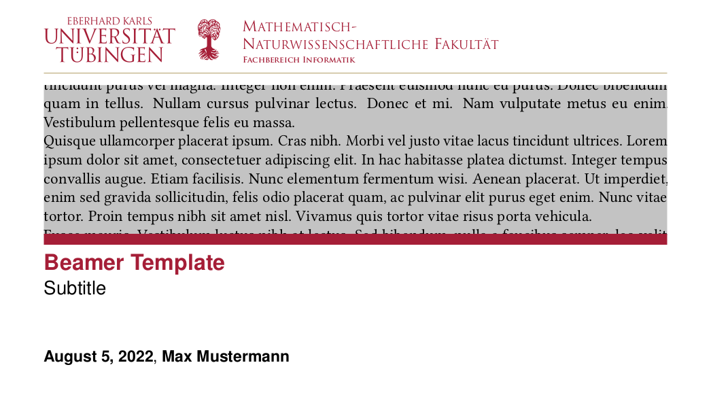
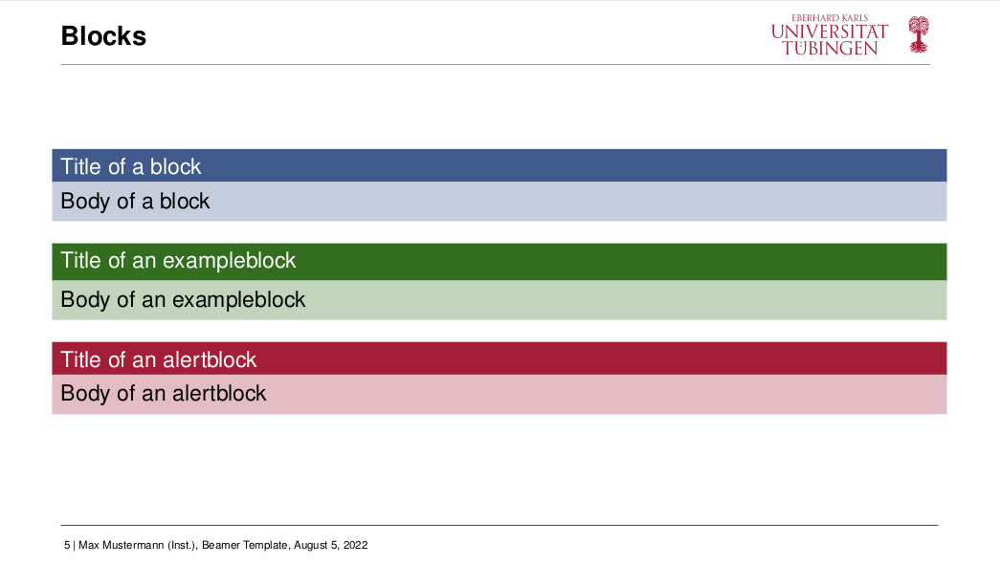
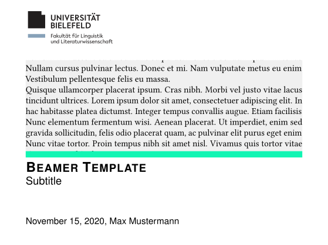

# beamer-template

LaTeX template for Beamer slides

## Examples

### Theme "Lustnau" (16:9 format)

<kbd>

</kbd>

<kbd>

</kbd>

### Theme "Bielefeld" (4:3 format)

<kbd>

</kbd>

<kbd>

</kbd>
